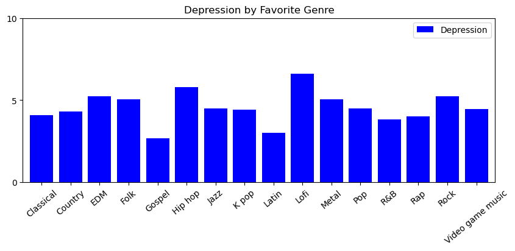
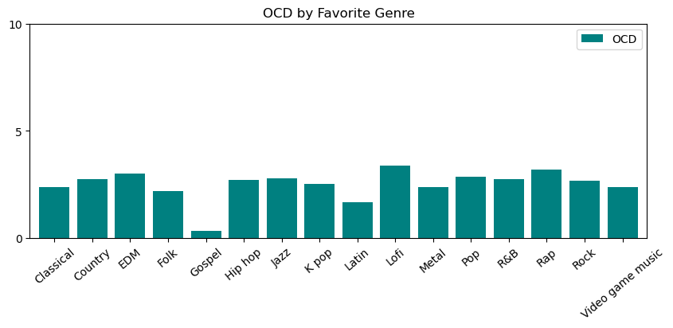
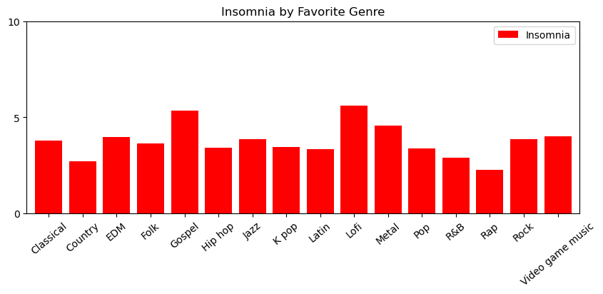
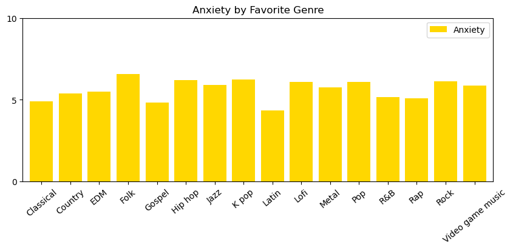

# Effect of Music Genres on Mental Health

## Introduction
This project explores the potential correlations between music genres and various mental health conditions such as depression, insomnia, OCD (Obsessive-Compulsive Disorder), and anxiety. By analyzing survey data, we aim to uncover any patterns or trends that suggest certain music preferences may impact mental well-being.

## Data Source
`https://www.kaggle.com/datasets/catherinerasgaitis/mxmh-survey-results/data`

The data used for this analysis was collected through surveys conducted among individuals reporting their favorite music genres along with self-assessments of their mental health conditions. The dataset is stored in a CSV file named `mxmh_survey_results.csv`, located in the `Resources` directory.

## Libraries and Dependencies
The project utilizes several Python libraries for data analysis and visualization:
* **Pandas**: For data manipulation and analysis.
* **Scikit-learn (sklearn)**: For dataset loading.
* **Scipy (scipy)**: For statistical analysis.
* **Matplotlib**: For creating visualizations.

## Installation
To run the code locally, follow these steps:
1. Clone the repository to your machine:
   1. git clone `https://github.com/jdanielle12/project1`
2. Navigate to the project directory:
   1. `cd project1`
3. Install the required Python libraries:
   1. `pip install -r requirements.txt`

## Usage
1. Ensure you have Python installed on your machine.
2. Install the project dependencies as described in the installation section.
3. Navigate to the notebook file/branch. For example: `Depression.ipynb` from the project explorer.
4. Open the notebook using the Jupyter extension in VSCode.
5. Run the cells within the notebook to execute the analysis interactively. 

## Project Structure
The project repository is organized into branches corresponding to each mental health condition analyzed:
* **Depression**: Contains code and analysis related to depression.
* **OCD**: Contains code and analysis realted to OCD.
* **Insomnia**: Contains code and analysis related to insomnia.
* **Anxiety**: Contains code and analysis related to anxiety.

Each branch includes scripts, notebooks, and visualizations specific to the respective mental health condition.

## Data Preprocessing
1. The CSV data is read into a Pandas DataFrame, with the first column serving as the row index. 
2. The 'Timestamp' column, which is irrelevant to our analysis, is dropped. 
3. Rows with missing or NaN (Not a Number) values are removed from the DataFrame to ensure data integrity. 

## Analysis 

### Correlation Analysis
The project investigates the correlation between each mental health condition and favorite music genres using bar charts. Specifically: 
* **Depression**: Correlation with favorite genres.
* **OCD**: Correlation with favorite genres.
* **Insomnia**: Correlation with favorite genres.
* **Anxiety**: Correlation with favorite genres.

### Further Analysis 
To explore the correlations further, we focused on the three most associated genres with each mental health condition:
1. **Depression**:
   1. Lofi
   2. Rock
   3. Hip hop
2. **OCD**: 
   1. Lofi
   2. Rock
   3. Hip hop
3. **Insomnia**: 
   1. Lofi
   2. Rock
   3. Hip hop
4. **Anxiety**:
   1. Lofi
   2. Rock
   3. Hip hop

For each of these genres, correlations were computed between the respective mental health condition and other variables such age, BPM, and hours of music listening per day. 

### Results
Various statistics are computed to understand the sample data, including:
* Average age of participants.
* Average scores for each mental health condition (Depression, Anxiety, Insomnia, OCD).

### Visualizations
The distributions of age and each mental health condition are visualized using bar charts. Scatter plots illustrate the relationships between age, BPM, hours of music listening per day, and mental health conditions.

### Conclusion
Through this analysis, we aim to provide insights into how music preferences may influence mental well-being. The results obtained can serve as a basis for further research and potentially inform interventions or therapeutic approaches leveraging music.

## Examples

#### Contributors
* Randolph Bradley
* Jacqueline Columbro
* Kyle Kerner 
* Jamie McGraner
